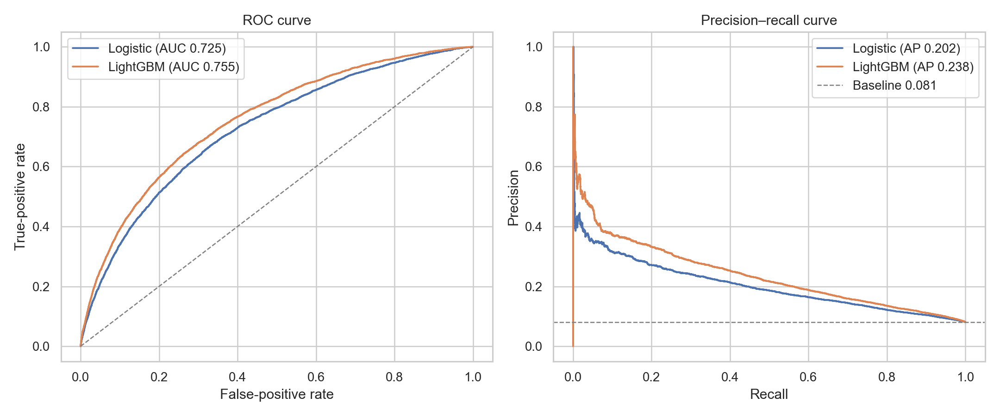
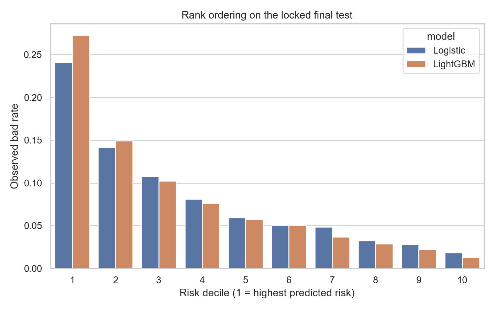

# Credit Risk Modeling & Validation — Home Credit

I built a borrower-level credit-risk workflow from **307,511 applications**, combining application data with four relational sources of credit and repayment history. The project compares an interpretable Logistic benchmark with a LightGBM challenger under nested validation. Primary outer-CV ROC-AUC rises from **0.6579** with application data alone to **0.7232** after adding history, then to **0.7534** with LightGBM. The highest-risk 10% of applicants capture **32.70%** of observed payment-difficulty events in outer CV.

## Key results

| Model | Outer-CV ROC-AUC | PR-AUC | KS | Top-10% capture |
|---|---:|---:|---:|---:|
| Application-only Logistic | 0.6579 | 0.1455 | 0.2354 | 22.18% |
| Full Logistic | 0.7232 | 0.2004 | 0.3319 | 29.21% |
| LightGBM | **0.7534** | **0.2346** | **0.3786** | **32.70%** |

Application data → historical behaviour → nonlinear model is the central comparison.



## Business interpretation

Historical credit and repayment behaviour improves risk ranking by 0.0652 AUC over the application-only Logistic model. LightGBM adds another 0.0303, while Logistic remains useful as the transparency-first benchmark through standardized coefficients and cross-fold sign stability.

The capacity analysis frames the scores as a workload decision. If a risk team can inspect only a fixed share of applicants, it can rank applicants by score and measure how much observed payment-difficulty risk is concentrated in that review queue. This avoids choosing an arbitrary probability cutoff without business cost assumptions.

## Data and feature design

The modelling table contains 24,825 events (8.1%) and 99 candidate predictors at one row per `SK_ID_CURR`.

| Feature family | Predictors |
|---|---:|
| Application and affordability | 23 |
| Bureau credit history | 19 |
| Bureau monthly status | 13 |
| Previous applications | 22 |
| Installment behaviour | 22 |

Historical records must be observable by the application date. The build applies day/month-0 filters, consolidates partial installment payments, and keeps denominator-aware delinquency rates and no-history flags. Relationship IDs and post-application fields do not enter the model.

`TARGET` is Home Credit's payment-difficulty competition outcome; it is not a regulatory probability-of-default definition.

## Validation design

Primary performance evidence comes from five-fold outer stratified cross-validation across the full labelled population. Preprocessing, feature clipping, imputation, category handling, scaling, and model selection are fitted within training partitions.

- Logistic `C` is selected from `0.01`, `0.1`, `1`, and `10` using three inner folds.
- LightGBM candidate and iteration selection use an inner validation split inside each outer-training fold. Outer validation rows are used only for scoring the locked fold design.
- Raw outer out-of-fold scores provide Brier and calibration slope/intercept diagnostics; no calibration transform is applied.
- The model choice rule keeps LightGBM only when outer-CV AUC exceeds Logistic by at least 0.005.

The original stratified 80/20 split is retained as a **legacy holdout** for continuity with the earlier project version. Because that population had already been evaluated, outer CV is the primary evidence and the legacy result is a secondary comparison.

## Legacy-holdout review-capacity illustration

On the 61,503-row legacy holdout, LightGBM records 0.7552 ROC-AUC. Its top decile captures 33.90% of observed events at 3.39× portfolio lift.

| Review capacity | Applicants reviewed | Events captured | Capture | Observed event rate | Lift |
|---|---:|---:|---:|---:|---:|
| 5% | 3,076 | 1,006 | 20.26% | 32.70% | 4.05× |
| 10% | 6,151 | 1,683 | 33.90% | 27.36% | 3.39× |
| 20% | 12,301 | 2,602 | 52.41% | 21.15% | 2.62× |

These rows illustrate risk concentration at fixed review workloads; they are not lending cutoffs.



## Repository structure

```text
data/raw/                   local source files and data instructions
data/processed/             ignored borrower-level and split artifacts
notebooks/01_data_audit.ipynb
notebooks/02_feature_engineering.ipynb
notebooks/03_model_development.ipynb
notebooks/04_model_validation.ipynb
src/                        data contracts, features, modelling, validation
tests/                      methodology and data-contract tests
outputs/tables/             generated analytical tables
outputs/figures/            generated figures
```

## Reproduction

Run from the repository root:

```bash
python -m venv .venv
source .venv/bin/activate
pip install -r requirements.txt
pytest -q
python -m jupyter nbconvert --execute --to notebook --inplace notebooks/01_data_audit.ipynb
python -m jupyter nbconvert --execute --to notebook --inplace notebooks/02_feature_engineering.ipynb
python -m jupyter nbconvert --execute --to notebook --inplace notebooks/03_model_development.ipynb
python -m jupyter nbconvert --execute --to notebook --inplace notebooks/04_model_validation.ipynb
```

Place the six files listed in [`data/raw/README.md`](data/raw/README.md) before running. On macOS, LightGBM may require `brew install libomp`. Raw data, processed borrower records, split IDs, and fitted artifacts remain local.

Generated evidence: [`outer_cv_model_comparison.csv`](outputs/tables/outer_cv_model_comparison.csv), [`legacy_holdout_model_metrics.csv`](outputs/tables/legacy_holdout_model_metrics.csv), [`capacity_analysis.csv`](outputs/tables/capacity_analysis.csv), and [`feature_family_summary.csv`](outputs/tables/feature_family_summary.csv).

## Limitations

- The dataset does not provide external or out-of-time validation.
- The 80/20 legacy holdout was evaluated in an earlier project version and is reported only for continuity.
- The competition target is not a regulatory PD definition or evidence of production lending suitability.
- Age, family status, education, occupation, housing, and asset variables may encode sensitive or socioeconomic effects; subgroup checks cannot establish fairness.
- Coefficients and feature importance are associative, while review-capacity results omit lending economics, reject inference, policy constraints, and portfolio drift.
