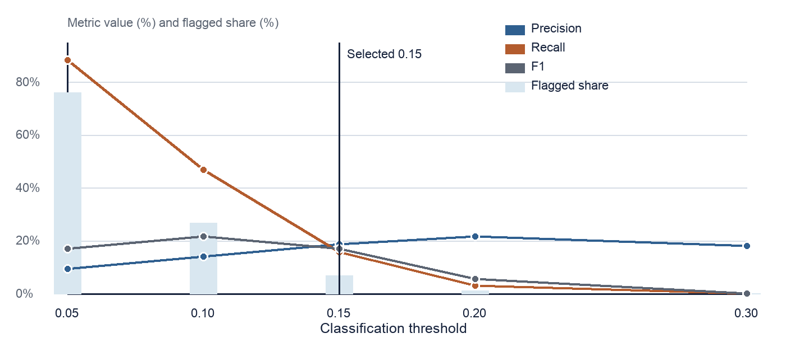
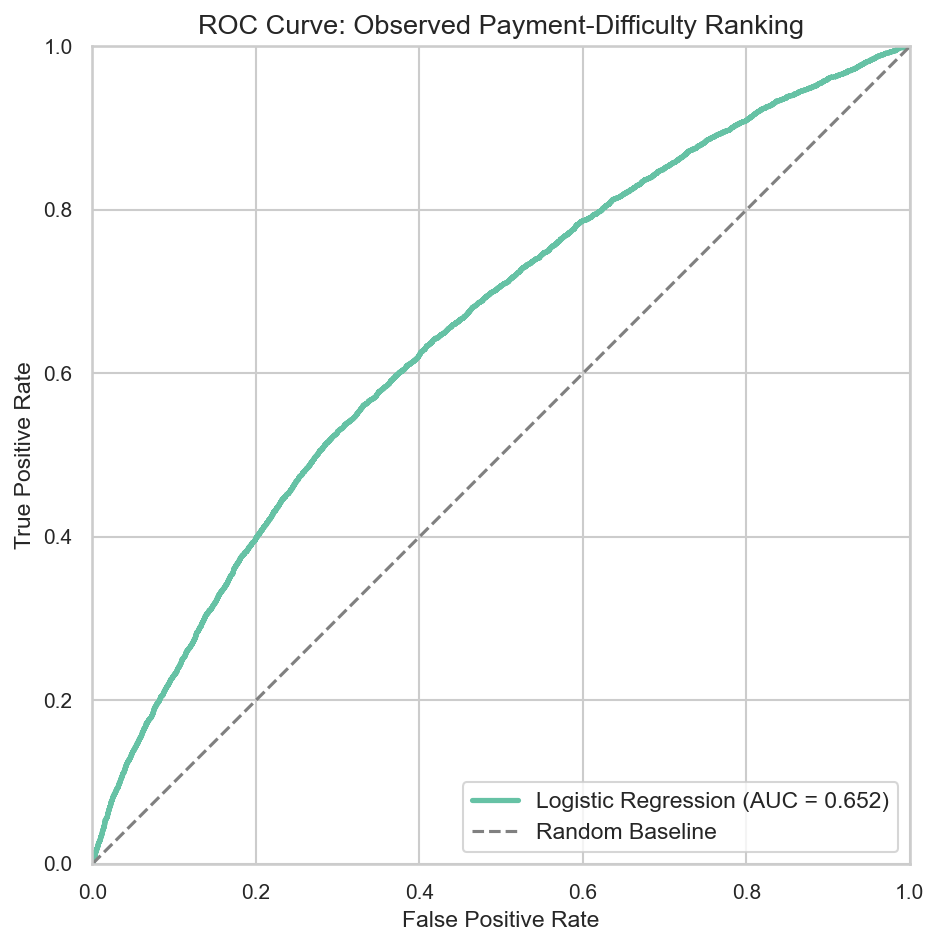
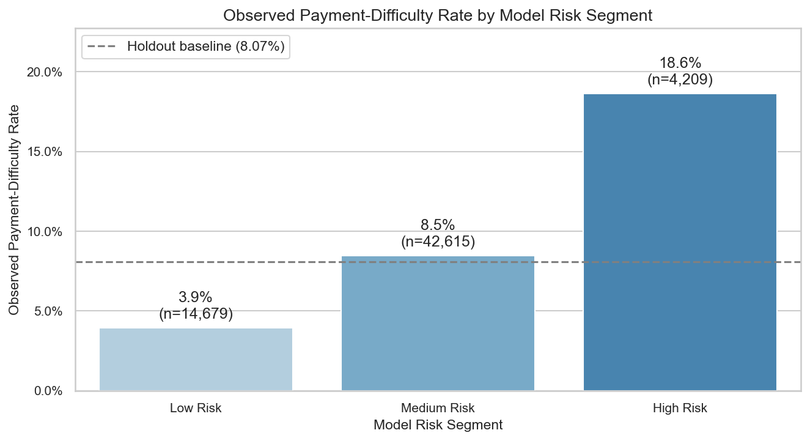

# Credit Risk Default Prediction

An interpretable credit-risk analytics workflow built with Python and Logistic Regression using the Home Credit `application_train.csv` dataset.

The project covers data checks, exploratory analysis, feature engineering, preprocessing, baseline modeling, threshold evaluation, application risk segmentation, and business interpretation. It prioritizes a clear and explainable workflow rather than Kaggle leaderboard optimization.

[View the complete analysis notebook](notebooks/01_credit_risk_default_prediction.ipynb)

## Key Results

| Result | Holdout performance |
| --- | ---: |
| Observed payment-difficulty rate | 8.1% |
| ROC-AUC | 0.652 |
| Implied Gini (`2 × ROC-AUC - 1`) | approximately 0.304 |
| Illustrative classification threshold | 0.15 |
| Applicants flagged High Risk | 4,209 of 61,503 (approximately 6.8%) |
| High Risk observed payment-difficulty rate | 18.6% |
| Recall at 0.15 | 15.8% |
| F1-score at 0.15 | 17.1% |
| High Risk lift versus holdout baseline | approximately 2.3× |

At the illustrative `0.15` threshold, the model flags `6.8%` of holdout applicants, with an `18.6%` observed payment-difficulty rate and `15.8%` recall. This demonstrates the trade-off between review capacity and risk coverage.

The model is most useful as a prioritization tool: it identifies a small applicant group with substantially higher observed risk while making the coverage trade-off created by limited review capacity visible.

## Business Problem

Credit teams need to identify applicants who are more likely to experience repayment difficulty while balancing credit-loss exposure, manual-review capacity, customer experience, and regulatory requirements.

An interpretable baseline model can show how risk scores may support:

- applicant risk ranking;
- manual-review prioritization;
- enhanced documentation or verification;
- application risk segmentation; and
- portfolio-level risk reporting.

Because the target event represents only about `8.1%` of observations, accuracy alone would be misleading. The analysis therefore focuses on ranking performance, precision, recall, threshold trade-offs, and segment-level event rates.

## Dataset and Target Definition

The project uses the [Home Credit Default Risk dataset from Kaggle](https://www.kaggle.com/competitions/home-credit-default-risk/data).

Source files expected in `data/raw/`:

- `application_train.csv`: used for analysis and modeling;
- `HomeCredit_columns_description.csv`: optional, used only to interpret field definitions and support documentation.

The raw application table contains `307,511` applications and `122` columns. This first version uses a limited set of application-level fields and intentionally excludes the additional Home Credit tables to keep the workflow focused and interpretable.

In this project, **“default risk” is used as project shorthand for the dataset’s payment-difficulty outcome**. The dataset target should not be interpreted as a regulatory, contractual, or internal bank definition of default.

- `TARGET = 1`: observed payment difficulty in the dataset;
- `TARGET = 0`: no observed payment difficulty under the dataset definition;
- dataset observed payment-difficulty rate: approximately `8.1%`.

The raw CSV files are excluded from GitHub by `.gitignore`. To reproduce the notebook, download the Kaggle data separately and place the required CSV files under `data/raw/`.

## Methodology

The notebook follows this workflow:

1. Load selected application fields.
2. Validate the application grain using `SK_ID_CURR`, duplicate checks, and target-domain checks.
3. Inspect numeric distributions and known abnormal values.
4. Treat positive `DAYS_EMPLOYED` placeholder values as missing.
5. Engineer interpretable age, employment, and affordability features.
6. Perform descriptive EDA by applicant and loan characteristics.
7. Create a stratified `80/20` train/holdout split.
8. Estimate 0.1%/99.9% clipping bounds from the training set and apply the frozen bounds to both splits.
9. Fit preprocessing and Logistic Regression using the training data.
10. Evaluate ranking performance and threshold-dependent metrics on the holdout set.
11. Map model scores into Low, Medium, and High Risk segments.

Numeric variables are median-imputed and standardized. Categorical missing values are assigned to an explicit `Unknown` category and encoded with `drop="first"`, giving each categorical coefficient a named reference group. Imputation, scaling, and encoding are fitted on the training data. Distribution-based clipping is also learned from the training set only, preventing the holdout distribution from influencing preprocessing rules.

### Selected source fields

- `AMT_INCOME_TOTAL`
- `AMT_CREDIT`
- `AMT_ANNUITY`
- `AMT_GOODS_PRICE`
- `SK_ID_CURR` (data-quality checks only)
- `NAME_CONTRACT_TYPE`
- `CODE_GENDER` (raw-data checks only; excluded from the model)
- `FLAG_OWN_CAR`
- `FLAG_OWN_REALTY`
- `DAYS_BIRTH`
- `DAYS_EMPLOYED`
- `NAME_EDUCATION_TYPE`
- `NAME_FAMILY_STATUS`
- `NAME_HOUSING_TYPE`
- `OCCUPATION_TYPE`

### Engineered model features

- `AGE_YEARS = -DAYS_BIRTH / 365.25`
- `YEARS_EMPLOYED = -DAYS_EMPLOYED / 365.25`, after treating abnormal positive placeholders as missing
- `CREDIT_INCOME_RATIO = AMT_CREDIT / AMT_INCOME_TOTAL`
- `ANNUITY_INCOME_RATIO = AMT_ANNUITY / AMT_INCOME_TOTAL`

The original `DAYS_BIRTH` and `DAYS_EMPLOYED` fields are transformed into years and are not used alongside their transformed versions. `SK_ID_CURR` is excluded as an identifier. `CODE_GENDER` is also excluded from the formal model as a governance choice because its use may create fairness, legal, and compliance risk.

Model configuration:

- model: Logistic Regression;
- solver: `liblinear`;
- regularization: L2 with `C=1.0`;
- maximum iterations: `1000`;
- class weighting: none (`class_weight=None`);
- split: `test_size=0.2`;
- random state: `42`;
- stratification: `TARGET`;
- numeric preprocessing: median imputation and standard scaling;
- categorical preprocessing: constant `Unknown` imputation and one-hot encoding with `drop="first"`.

The threshold comparison is used to show coverage and review-volume trade-offs rather than applying `class_weight="balanced"` or tuning a policy cutoff. The `0.15` threshold is illustrative and was not independently validated or optimized against real lending losses.

## Model Evaluation

| Metric | Value |
| --- | ---: |
| Observed payment-difficulty rate | 0.081 |
| ROC-AUC | 0.652 |
| Implied Gini | approximately 0.304 |
| Illustrative threshold | 0.15 |
| Precision | 0.186 |
| Recall | 0.158 |
| F1-score | 0.171 |

ROC-AUC measures ranking performance across thresholds. Precision measures the observed event rate among flagged applicants, while recall measures the share of all payment-difficulty cases captured by the flag. Gini is shown as the approximate value implied by `2 × ROC-AUC - 1`.

The `0.15` threshold is used to demonstrate the relationship between review volume, precision, and recall. It was not selected using real lending costs or operational constraints.

### Threshold trade-off

The threshold trade-off chart shows how flagged share, precision, recall, and F1 change as the classification cutoff moves. The selected `0.15` threshold narrows the review group while keeping the precision and recall trade-off explicit.





Detailed outputs:

- [Model metrics](outputs/model_metrics.csv)
- [Threshold comparison](outputs/threshold_comparison.csv)
- [Logistic Regression coefficients](outputs/logistic_regression_coefficients.csv)

## Risk Segmentation

Model-generated payment-difficulty scores are mapped into three illustrative segments:

| Segment | Rule |
| --- | --- |
| Low Risk | score < 0.05 |
| Medium Risk | 0.05 ≤ score < 0.15 |
| High Risk | score ≥ 0.15 |

| Segment | Applicants | Observed payment-difficulty rate | Holdout baseline | Lift vs baseline | Average predicted score |
| --- | ---: | ---: | ---: | ---: | ---: |
| Low Risk | 14,679 | 3.9% | 8.1% | 0.5× | 3.6% |
| Medium Risk | 42,615 | 8.5% | 8.1% | 1.0× | 8.6% |
| High Risk | 4,209 | 18.6% | 8.1% | 2.3× | 17.9% |



The High Risk segment contains a relatively small group of applicants with an observed payment-difficulty rate approximately `2.3×` the holdout baseline. Its `15.8%` recall shows the corresponding trade-off between targeted review and broader risk coverage.

[View the risk segment summary](outputs/risk_segment_summary.csv)

## Business Interpretation

The EDA identifies several descriptive associations in the sample:

- younger applicants show higher observed payment-difficulty rates than older applicants;
- lower education categories show higher observed rates than higher education categories;
- applicants recorded as being in a civil marriage or as single/not married show higher observed rates than the married and widow categories;
- applicants without a car show a higher observed rate than applicants with a car; and
- `CREDIT_INCOME_RATIO` and `ANNUITY_INCOME_RATIO` help describe repayment burden.

These findings describe associations within the dataset and should not be interpreted as causal relationships.

The segmentation illustrates how model scores could support manual-review prioritization, enhanced verification, and portfolio-level reporting. Gender is excluded from the model; age and family status remain descriptive inputs whose real-world use would depend on jurisdiction, lending policy, fairness testing, and legal review.

## Limitations

- Public competition data rather than a current lender portfolio.
- Limited application-only feature set.
- Modest model discrimination (`ROC-AUC = 0.652`).
- No independent validation set or out-of-time testing.
- Uncalibrated scores and illustrative thresholds.
- No production cost, fairness, or compliance validation.

## Next Steps

1. Add cross-validation and an independent test design.
2. Add PR-AUC, KS, exact Gini, Brier score, and calibration analysis.
3. Select thresholds using explicit review-capacity and credit-loss assumptions.
4. Compare the Logistic Regression baseline with tree-based models and additional Home Credit tables.

## Project Structure

```text
credit-risk-default-prediction-python/
├── data/
│   └── raw/
│       └── README.md
├── docs/
│   └── project_reflection.md
├── notebooks/
│   └── 01_credit_risk_default_prediction.ipynb
├── outputs/
│   ├── figures/
│   ├── logistic_regression_coefficients.csv
│   ├── model_metrics.csv
│   ├── risk_segment_summary.csv
│   └── threshold_comparison.csv
├── .gitignore
├── README.md
└── requirements.txt
```

Raw CSV files are intentionally not tracked in Git. The expected data placement is documented in [data/raw/README.md](data/raw/README.md).

## How to Run

1. Download the [Home Credit Default Risk data from Kaggle](https://www.kaggle.com/competitions/home-credit-default-risk/data).
2. Place `application_train.csv` in `data/raw/`.
3. Optionally place `HomeCredit_columns_description.csv` in the same folder for field documentation.
4. From the project root, install dependencies and launch the notebook:

```bash
pip install -r requirements.txt
jupyter notebook notebooks/01_credit_risk_default_prediction.ipynb
```

To execute the notebook non-interactively from the project root:

```bash
python -m jupyter nbconvert --execute --to notebook --inplace notebooks/01_credit_risk_default_prediction.ipynb
```

Running the notebook generates or overwrites the documented CSV and figure outputs under `outputs/`.
